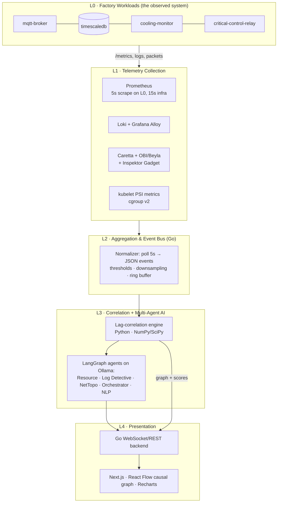
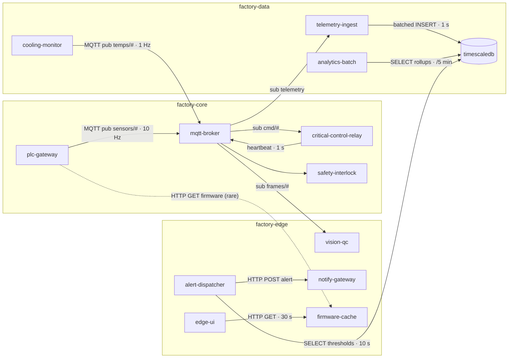
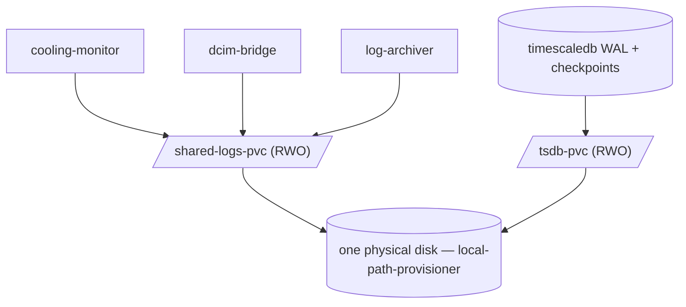

# SiliconKnights — Master Plan (Round 2 Build Blueprint)

**Theme 2: Beyond monitoring — AI agents for real-time pod resource discovery and dependency mapping**
Team: Soumyadip Das · Shivam Kumar · B Kishan · Aaryan Shyam Pillai
Status: Finalist (6 of 1000+). This document is the single source of truth for the Round 2 build.

---

## 0. Mission & the Round 2 bar

The deck promised, the demo must deliver:

| Promise (deck) | Round 2 proof |
|---|---|
| Real-time discovery of CPU/RAM/disk/PVC/network across all namespaces | Live dashboard showing 5 signal dimensions per pod, all namespaces |
| Multi-agent AI analysis (CPU, Memory, Storage/PVC, Log/IO) | 5 autonomous inference agents (statistical/graph engines, D-002) + local Ollama narrator, replayable reasoning traces |
| Interdependency mapping | eBPF topology + lag-correlation weighted causal graph, live |
| Intelligent recommendations, alerts, forecasting | NLP remediation cards + threshold alerts + trend forecast |
| < 30s detection, air-gapped | Stopwatch on demo: chaos trigger → NLP root cause < 30s, WiFi off |

Judging rubric (inferred from the problem statement's "Impact" section): running prototype on K3s, multi-agent framework, real-time dashboard, live demo of dependency detection, technical report. Every build decision below optimizes for those five artifacts.

**The four operational questions the system must answer on stage** (lifted verbatim from the problem statement — these are judge bait):

1. *Which pod is causing unexpected CPU spikes?* → Resource Agent + root-cause ranking (§1.4)
2. *How are PVC I/O patterns linked to pod restarts?* → Scenario S1/S3 + restart↔I/O correlation (§2.5)
3. *Are different services influencing each other's resource consumption?* → PSI noisy-neighbor evidence + lag correlation (§1.4.3)
4. *Which workloads need optimization?* → Recommendation engine: usage-vs-request right-sizing (§1.5.6)

---

## 1. System components — the tool itself

### 1.0 Architecture at a glance



**Data contract between layers** (everything downstream of L2 consumes only this):

| Hop | Transport | Format | Cadence |
|---|---|---|---|
| L1 → L2 | HTTP pull (PromQL/LogQL range queries) | Prometheus/Loki native | every 5s |
| L2 → L3 | NATS-less: HTTP POST + on-disk JSONL ring buffer | `Event` JSON (schema §1.3.3) | 5s bundles |
| L3 corr → L3 agents | LangGraph state | `CausalGraph` JSON (§1.4.4) | on anomaly or 30s |
| L3 → L4 | REST + WebSocket push | `Insight`, `GraphUpdate`, `Alert` | event-driven |

### 1.1 Cluster substrate

- **What:** single-node K3s on Ubuntu 22.04/24.04 VM (or bare metal), 4 vCPU / 16 GB minimum (24 GB comfortable).
- **Why K3s:** problem statement names it; lightweight (~512 MB control plane); ships `local-path-provisioner` (PVCs on local disk — exactly the storage model whose contention we demo); Traefik off (`--disable traefik`) to save RAM.
- **Critical flags:**
  - cgroup v2 (default on Ubuntu 22.04+) + kernel ≥ 5.x → PSI available.
  - `--kubelet-arg=feature-gates=KubeletPSI=true` (beta since K8s v1.34) → per-pod/container pressure metrics on `/metrics/cadvisor`.
  - Use K3s v1.34+ channel.
- **Dev vs demo:** k3d (K3s-in-docker) for laptop dev; real K3s VM for the demo (eBPF + PSI need a real kernel; this also sidesteps every "runs in docker" caveat that breaks tools like Pixie).
- **Namespaces:** `factory-core`, `factory-data`, `factory-edge` (L0); `observability` (L1/L2); `aiops` (L3); `dashboard` (L4); `chaos` (Chaos Mesh). Observability+AI pinned with `priorityClassName: low-priority` and hard CPU/MEM limits so the watcher never starves the watched (deck Risk #4).

### 1.2 L1 — Telemetry collection

Five collectors, zero app instrumentation. Each row: what → why it earns its RAM.

| Collector | Runs as | Collects | Build/deploy with | RAM budget |
|---|---|---|---|---|
| **Prometheus** (D-001) | 1 pod, `observability` | All metrics; L0 namespaces at **5s**, infra at 15s; retention 12h | `kube-prometheus-stack` Helm (brings kube-state-metrics, node-exporter, Alertmanager); Grafana subchart off | ~600–800 MB at our series count (≤ 50k) |
| **kube-state-metrics** | bundled above | Pod phases, restarts, OOMKilled reasons, PVC claims | — | 50 MB |
| **node-exporter** | DaemonSet (1 node = 1 pod) | Node disk `io_time`, netstat retransmits, PSI node-level | — | 30 MB |
| **cAdvisor (in kubelet)** | built-in | `container_cpu_*`, `container_memory_working_set_bytes`, throttling counters, **`container_pressure_*` PSI** | nothing to install; scrape `/metrics/cadvisor` | 0 |
| **Loki + Grafana Alloy** | 2 pods | Container logs, per-namespace streams | `loki-stack` Helm; **Alloy, not Promtail** (Promtail deprecated → EOL Mar 2026) | ~600 MB |
| **Caretta** | DaemonSet | eBPF TCP flow map: who-talks-to-whom + throughput, exported as Prometheus metrics | groundcover Caretta Helm | ~150 MB |
| **OBI (OpenTelemetry eBPF Instrumentation, ex-Grafana Beyla)** | DaemonSet | Zero-code RED metrics: HTTP/gRPC request rate, errors, **latency histograms** per service | Beyla Helm chart, Prometheus exporter mode | ~250 MB |
| **Inspektor Gadget** | on-demand CLI/DaemonSet | Per-pod **block I/O top, file activity, TCP retransmits** — attributes disk I/O to pods (cAdvisor can't on overlayfs) | `kubectl gadget deploy`; run `top_blockio`, `top_file` gadgets during incidents | ~100 MB |

Design rulings:

- **Prometheus over VictoriaMetrics (D-001, reverses plan v1.0 — see BUILD_LOG LOG-002).** At our scale (≤ 50k series, 12h retention) Prometheus fits in well under 1 GB, so VM's headline RAM advantage buys little, while costing deck consistency, PromQL/MetricsQL edge-case parity, and the stock Alertmanager path. VM stays a *documented contingency*: scrape configs are compatible, swap is half a day if the demo box runs hot. Verdict on "is VM as good?": for big fleets, often better (RAM, compression, ingest); for a 15-pod single node, the differences are noise — familiarity and zero migration risk win.
- **Pixie is out.** Deck said "Pixie/Cilium eBPF". Pixie requires 1 GiB+ per node (2 GiB default) and **explicitly does not support K3s/k3d**. Replacement trio Caretta+OBI+Inspektor Gadget costs ~500 MB and covers flows, latency, and disk attribution. Update the architecture slide.
- **5s scrape on L0 only.** Fixes the deck's internal inconsistency (claimed 5s-lag detection from 15s scrape — impossible). vmagent handles 5s on ~15 pods trivially; infra targets stay at 15s.
- **PSI is the secret weapon** (from Koordinator research, §4.3): `container_pressure_cpu_stalled_seconds_total`, `..._memory_...`, `..._io_...` = kernel ground truth that a pod is *stalled waiting* for a resource, not merely using it. Utilization says "busy"; PSI says "suffering". We use it to (a) detect noisy neighbors, (b) **confirm correlation edges** before the AI ever sees them — direct mitigation of deck Risk #1 (correlation false positives).

### 1.3 L2 — Aggregation & normalization (Go)

- **What it does:** polls VM (PromQL) + Loki (LogQL) every 5s, evaluates threshold rules, reduces ~2,000 raw series → ~40 per-pod signal vectors, emits schema-stable JSON events. The architectural firewall that keeps raw Prometheus text away from LLMs (deck Risk #2).
- **Where:** 1 pod in `observability`, ~100 MB, no PVC (ring buffer in RAM + optional JSONL spill).
- **Build with:** Go 1.23+; `net/http` + `prometheus/client_golang` API client; `grafana/loki-client-go` or raw LogQL HTTP; `encoding/json`; clock-aligned ticker.
- **Internals:**
  1. **Query pack** (configmap-driven, ~25 PromQL strings): CPU rate, working-set bytes, fs/PVC usage (`kubelet_volume_stats_*`), network rx/tx, restart counters, throttle ratio, PSI rates, Caretta edge bytes, OBI p95 latency.
  2. **Normalizer:** label-joins to `{namespace, pod, signal, value, ts}`; linear-interpolates gaps ≤ 2 samples; min-max + robust z-score per signal.
  3. **Threshold engine:** static floors (CPU > 80%, PVC > 90%, restarts Δ > 0, PSI some-avg10 > 0.2, p95 latency > SLO) → `anomaly_candidate` events. Cheap, deterministic, explainable — the LLM never decides *whether* something is anomalous, only *why* (pattern stolen from K8sGPT's analyzer design, §4.4).
  4. **Ring buffer:** last 15 min of vectors (180 samples × pods × 8 signals) served to L3 over `GET /window`.

**Event schema** (frozen v1 — everything downstream depends on it):

```json
{
  "v": 1, "ts": "2026-06-12T10:31:05Z", "kind": "anomaly_candidate",
  "namespace": "factory-data", "pod": "cooling-monitor-7d4f",
  "signal": "pvc_io_util", "value": 0.94, "zscore": 4.1,
  "threshold": 0.90, "window_s": 60,
  "context": {"pvc": "shared-logs-pvc", "node": "edge-node-1", "restarts_15m": 0}
}
```

### 1.4 L3 — The Correlation & Dependency Engine (the multi-agent core)

**Design stance (D-002, BUILD_LOG LOG-003):** "AI agent" does not mean "LLM call". An agent here is *any autonomous inference engine with a defined input contract, a decision policy, and a structured output* — statistical, graph-theoretic, or neural. Four of the five agents parameterize and categorize threats entirely by themselves, with no language model in the loop. Exactly one LLM exists in the whole system, at the language edge (§1.5). Consequences: deterministic reruns, no hallucination surface inside the reasoning core, sub-second agent latency, and the model can stay cold until an incident needs narrating.

**Where it runs:** one pod (`aiops` ns), Python 3.12, ~300–400 MB. LangGraph orchestrates (it composes plain Python nodes just as happily as LLM nodes — we keep its state machine, checkpointing, and retry semantics; consistent with the deck's "LangChain workflow orchestration"). FastAPI serves results; Ollama runs as a separate pod, called by the language layer only.

#### 1.4.1 The five agents

| #   | Agent                      | Type of inference engine                                                                                                                                                                                                                       | Input (contract)                                      | Decision policy — how it parameterizes & categorizes by itself                                                                                                                                           | Output                                                                 |     |                           |
| --- | -------------------------- | ---------------------------------------------------------------------------------------------------------------------------------------------------------------------------------------------------------------------------------------------- | ----------------------------------------------------- | -------------------------------------------------------------------------------------------------------------------------------------------------------------------------------------------------------- | ---------------------------------------------------------------------- | --- | ------------------------- |
| A1  | **Resource Agent**         | Statistical: EWMA residual + CUSUM changepoints; pattern classifier on shape features (slope, kurtosis, periodicity via ACF, plateau ratio); linear/EWMA extrapolation forecaster. Optional LSTM-AE module (honors deck claim; off by default) | per-pod signal matrix from L2 (`GET /window`)         | self-tunes baselines per signal (rolling median ± MAD); categorizes each anomaly: `burst / leak / saturation / throttle / flap`; estimates time-to-limit ("OOM in ~80s", "PVC full in ~42 min")          | `ResourceFinding[] {pod, signal, class, onset_ts, severity, forecast}` |     |                           |
| A2  | **Log Detective**          | Drain3 log-template miner + per-template rate model (Poisson surprise) + novelty detector (first-seen templates); regex extractors for OOM/timeout/crash/probe-fail                                                                            | Loki streams, pre-filtered ERROR/WARN + kube events   | clusters raw lines into templates unsupervised; flags templates whose rate spikes inside an anomaly window; tags evidence type                                                                           | `LogEvidence[] {pod, template_id, sample, rate_z, kind}`               |     |                           |
| A3  | **Network/Topology Agent** | Graph engine: maintains the steady-state topology (Caretta flows + OBI RED + shared-PVC/node relations); EWMA on per-edge latency/retransmit; flags degraded edges                                                                             | Caretta metrics, OBI histograms, kube-state relations | decides *edge health* on its own thresholds (p95 vs baseline ×1.5, retransmit z>3); marks which physical paths could carry causality                                                                     | `EdgeAnnotation[] {src, dst, kind: net                                 | pvc | node, health, p95_ratio}` |
| A4  | **Correlator** (the heart) | Lagged cross-correlation + evidence gate + causal graph assembly + explanatory-reach root-cause ranking (full math in §1.4.2–1.4.5)                                                                                                            | A1 onsets, A3 topology, L2 vectors                    | builds the directed weighted lagged causal graph; ranks root causes; computes blast radius                                                                                                               | `CausalGraph` (§1.4.5)                                                 |     |                           |
| A5  | **Orchestrator/Verdict**   | Evidence-weighted scorer (rule table + weighted vote): does log evidence corroborate the top-ranked cause? do PSI witnesses agree? conflict → demote and annotate                                                                              | A1+A2+A3+A4 outputs                                   | sets final confidence + severity; decides whether to wake the language layer; max 3 read-only K8s tool calls to fill gaps (events, restart history, blockio top) — bounded agentic step, HolmesGPT-style | `Verdict {root_cause, confidence, chain, evidence_ids, severity}`      |     |                           |

#### 1.4.2 Anomaly detection (A1 internals)

Per signal: EWMA baseline (α=0.3); residual fed to two-sided CUSUM (k=0.5σ, h=5σ) → onset timestamp accurate to one 5s sample. Robust z-score (median/MAD) for severity. Classifier is a hand-rolled decision tree over shape features — no training data needed, fully explainable on stage. LSTM-autoencoder ships as a flag-gated alternative scorer; never the sole detector in the demo.

#### 1.4.3 Lag correlation (A4 internals)

- Vectors: 15-min rolling window, 5s resolution (180 samples), linear interpolation for gaps ≤ 2 samples, z-normalized.
- For every candidate pod pair (pruned: only pairs where ≥1 pod has an active A1 finding — keeps it ~hundreds of pairs, <200 ms): Pearson r at lags {0, 5, 15, 30, 60, 120}s via `scipy.signal.correlate`; keep peak |r| and its lag; direction = sign of lag (A leads B).
- Spearman fallback when a signal is heavy-tailed (|skew|>2) — bursts violate Pearson normality assumptions.

#### 1.4.4 Edge acceptance gate — the false-positive killer (deck Risk #1)

An edge enters the causal graph only if **all three** hold:

1. **Statistical:** peak |r| ≥ 0.6 *and* elevated (≥ 0.4) at an adjacent lag window (kills single-window flukes).
2. **Physical witness — at least one of:**
   a. eBPF/Caretta says the pods actually talk (network path);
   b. PSI co-pressure: both pods stall on the *same resource class* within the same window **on the same node** (shared-resource contention has no network edge — PSI is the only witness; cross-node PSI coincidence is explicitly rejected, D-004 era rule for multi-node safety);
   c. shared PVC or same-node relation from kube-state-metrics.
3. **Temporal:** changepoint ordering consistent with lag direction (cause's onset precedes effect's).

Edges carry their evidence list `[stat, ebpf|psi|pvc, temporal]` — every line the UI or the LLM later utters traces back to these.

#### 1.4.5 Graph assembly, root cause, blast radius

- Nodes = pods (size = anomaly intensity); accepted causal edges (thick, lag-badged) overlaid on steady-state topology (thin).
- **Root-cause ranking:** **explanatory reach** (replaced PageRank — LOG-014: seeding PageRank at symptoms hands the symptom the restart mass and ranks it above its own cause). Each candidate scores by how much of the symptom set it explains via forward reachability with decay; nodes that themselves have an upstream explainer are penalized ×0.5; isolated symptoms with no in-edges explain themselves (self-caused leaks). Tie-break by earliest onset. Deterministic and narratable: "cooling-monitor explains 42% of observed degradation." Top-3 with normalized scores.
- **Blast radius / forecast:** forward BFS with weight decay (w×0.7 per hop, cut at 0.15) → impacted set + *predicted next victims* with ETA from edge lags — this is the "forecasting" demo beat.
- Output `CausalGraph`: `{nodes[], edges[{src,dst,r,lag_s,evidence[]}], root_cause_ranking[{pod,score,onset_ts}], blast_radius[], fairness_index}` — fully deterministic, JSON-schema-frozen.

#### 1.4.6 Orchestration & scheduling (LangGraph wiring)

```
trigger: anomaly_candidate event (L2)  ──┐            cadence: every 30s idle tick
                                         ▼
   [A1 Resource] ─┬─► [A4 Correlator] ─► [A5 Verdict] ─► confidence ≥ 0.5 ? ─► [L4 push + §1.5 language layer]
   [A2 LogDet]  ──┤        ▲                 │ < 0.5
   [A3 NetTopo] ──┘        │                 └─► hold, keep watching (no alert spam)
                    steady topology
```

A1–A3 run parallel (LangGraph fan-out), A4 joins, A5 gates. Full pass budget: < 2 s without LLM. Checkpointed state means a crashed pass resumes, and judges can replay any incident step-by-step from the LangGraph trace — a strong transparency demo.

#### 1.4.7 Failure modes & answers

| Failure | Behavior |
|---|---|
| Correlator finds nothing but thresholds fired | Verdict emits "anomaly, cause unconfirmed" — honesty beats invention |
| Two simultaneous root causes (S1+S3 overlap) | PageRank yields two seeds → two chains; UI shows both cards |
| Sparse window (pod just started) | pair skipped until 60 samples; noted in graph metadata |
| Judge: "correlation ≠ causation?" | the gate **is** the answer: temporal precedence + physical witness + multi-window stability; rehearse the 30-second version |

### 1.5 Language layer — the only LLM in the building

- **Job:** translate `Verdict` + `CausalGraph` into (a) a 4-sentence operator summary, (b) a remediation card in scheduler verbs (§4.1: reclaim / consolidate / throttle / resize), (c) answers to free-text operator questions ("why did CCR slow down?") grounded in the graph.
- **Model:** Ollama, 4B-class instruct (e.g. `phi3.5` / `qwen`-class) Q4, ~2.5 GB; 8B only on 24 GB boxes. JSON-schema-constrained output, temperature 0.2. Warmed when the first `anomaly_candidate` fires (10–20 s before it's needed); `keep_alive` through the incident.
- **Hard rule (Causely steal):** the LLM narrates the deterministic graph; it never invents causality. Prompt contains *only* structured findings + evidence IDs; every output sentence must cite ≥ 1 evidence ID (validated post-hoc; missing citation → regenerate once → template fallback). Render citations as clickable links.
- **Fallback:** Jinja template renders a serviceable summary from `Verdict` alone — the demo can survive total model failure; the stopwatch claim (< 30 s) is met by the deterministic path regardless.
- **Privacy garnish (K8sGPT steal):** optional pod-name anonymization before the model, de-anonymized after.
- **Recommendation engine (§0 Q4):** deterministic right-sizing pass (p95 usage vs requests/limits) feeds the card text — "analytics-batch requests 1 CPU, p95 uses 80m → reclaim 0.9 CPU".

### 1.6 L4 — Dashboard

- **Backend:** Go (chi router + nhooyr/websocket). Subscribes to L3 outputs, fans out over WS; REST for history. ~50 MB pod. Endpoints: `GET /api/graph`, `GET /api/timeline`, `GET /api/insights`, `WS /live`, `POST /api/scenario/{id}` (demo trigger — fires Chaos Mesh CRs via K8s API).
- **Frontend:** Next.js 14 (static export served by the Go binary — one container, no node runtime in prod). React Flow (causal graph: node size = anomaly intensity, edge width = r, animated edges during active propagation, lag badges). Recharts (synced multi-pod time-series with anomaly shading). Panels:
  1. **Live causal graph** (the money shot)
  2. **Incident timeline** — changepoint markers per pod, propagation chain replay slider
  3. **Pod detail drawer** — 8 sparklines incl. PSI, restarts, evidence links
  4. **PSI heatmap** — pods × {cpu,mem,io} pressure (the "noisy neighbor radar")
  5. **AI insight feed** — NLP cards with evidence links + remediation
  6. **Scenario console** — buttons that fire S1–S5 live (judges love pressing buttons)
- **Latency target:** chaos trigger → first dashboard alert < 15s; NLP card < 30s.

### 1.7 Cross-cutting

- **Repo layout:** monorepo `abb-accelerator/`: `deploy/` (Helm umbrella + per-layer charts), `workloads/` (L0 images), `aggregator/` (Go), `correlation/` (Py), `agents/` (Py), `dashboard/` (Next+Go), `scenarios/` (Chaos CRs + runbooks), `report/`.
- **One-command bring-up:** `make demo` → k3s check → helm install umbrella → wait healthy → seed baseline 10 min → open dashboard. Air-gap: all images pre-pulled into K3s containerd via `k3s ctr images import` from a tarball; Ollama model baked into image layer.
- **RAM budget (16 GB node):** K3s 1.2 + L0 workloads 3.0 + Prometheus 0.8 + Loki/Alloy 0.8 + eBPF trio 0.5 + L2 0.1 + correlation/agents 0.4 + Ollama (4B, warm) 3.5 + dashboard 0.15 ≈ **10.5 GB**, ~5.5 GB headroom at incident peak. Idle (model cold — D-002 makes this the normal state) ≈ **7 GB**. 8B model: 24 GB box only.

---

## 2. The Pod System (L0) — "the factory floor we observe"

Design goal: a pod estate that (a) looks like a real industrial edge deployment on the dependency graph — visually impressive, recognizably ABB; (b) reproduces, *with mechanically accurate root causes*, every failure class the problem statement names: bursty workloads, large file I/O, PVC storage stress, multi-service dependency behavior, sudden anomalies and leaks; (c) is fully scriptable so every demo run is identical.

Principle: **no pod fakes its metrics.** Every pathology is produced by the same kernel-level mechanism that produces it in a real data center (CFS throttling, page-cache writeback, WAL fsync, TCP backpressure, OOM-killer). The observability stack must *discover* the story, not be told it.

### 2.1 The narrative

A compact "smart factory cell": PLC telemetry flows over MQTT into a time-series store; a cooling system journals thermal logs; analytics and a vision-QC model crunch data; a critical control relay actuates machinery with a 100 ms SLO; alerts page operators. 15 pods, 3 namespaces, ~14 dependency edges — large enough that the causal graph looks serious, small enough that a judge can follow one cascade end-to-end.

### 2.2 Pod roster

| # | Pod | NS | Role in story | Resource signature | Pathology it carries | Implementation |
|---|---|---|---|---|---|---|
| 1 | `plc-gateway` | core | Simulated PLC fleet: 200 sensor channels → MQTT @ 10 Hz | steady net/CPU | none (steady source) | Go + paho-mqtt; jittered sine+noise payloads |
| 2 | `mqtt-broker` | core | Message hub (the fan-out node) | network-heavy | saturation under storm (S4) | Eclipse Mosquitto, QoS1 |
| 3 | `critical-control-relay` (CCR) | core | Subscribes commands, "actuates"; **SLO: p95 actuation < 100 ms**; exposes latency histogram | latency-sensitive, small | terminal victim of every cascade | Go; liveness probe `timeoutSeconds: 2` — degrades visibly, never crash-loops |
| 4 | `safety-interlock` | core | Watches CCR heartbeat; trips to safe-mode on misses | tiny | cascade endpoint (state flip = unmissable on graph) | Go; heartbeat over MQTT |
| 5 | `timescaledb` | data | Telemetry store on its own PVC | PVC-heavy: WAL + checkpoints | checkpoint I/O storms (S1 contributor) | TimescaleDB image; `max_wal_size=256MB`, `checkpoint_timeout=60s` → frequent heavy checkpoints |
| 6 | `telemetry-ingest` | data | MQTT consumer → batched INSERTs | CPU+net, backpressure-visible | queue growth when DB slows (S1 link) | Python asyncio; exposes queue-depth gauge |
| 7 | `cooling-monitor` | data | Journals thermal logs to **shared-logs PVC** | bursty sequential writes | **I/O storm source (S1 trigger)**: 2 GB fsync-heavy flush | Python + `fio` sidecar-exec: `--rw=write --bs=1M --size=2g --fsync=32` |
| 8 | `dcim-bridge` | data | Snapshots rack telemetry to the **same shared-logs PVC** | small steady writes | first victim of PVC contention (S1) | Go; 4 MB write + fdatasync every 5s; write-latency histogram |
| 9 | `log-archiver` | data | Nightly compress+rotate of shared PVC | large file I/O: seq read+write | S2 trigger: `tar czf` of 4 GB | Alpine + Go wrapper; CronJob, also on-demand |
| 10 | `analytics-batch` | data | 5-min KPI rollups | **bursty CPU** | S3 trigger: 2-core matmul burst in a 500m-limit container → **CFS throttling** | Python NumPy; CronJob `*/5` |
| 11 | `vision-qc` | edge | "Defect detection" on frame stream | CPU bursts + **memory leak** | S5: retains decoded frames → working set climbs → **OOMKilled** → restart loop | Python; frame cache with disabled eviction, ~6 MB/s growth, limit 512Mi |
| 12 | `alert-dispatcher` | edge | Turns DB/log conditions into operator alerts | log-heavy | retry amplification when notify-gw degrades (S4) | Node.js; naive 3× retry, no backoff (deliberate anti-pattern) |
| 13 | `notify-gateway` | edge | Egress HTTP notifier | small | injected 200 ms latency via Chaos (S4) | Go |
| 14 | `edge-ui` | edge | Operator kiosk | static, tiny | **control pod — must stay green** (false-positive check) | nginx |
| 15 | `firmware-cache` | edge | Serves firmware blobs | mem-cache heavy | innocent high-RAM pod (tests "usage ≠ pressure" story) | nginx + tmpfs emptyDir (memory-backed — counts against pod RAM: nice gotcha to narrate) |

Shared-resource geometry that makes cascades real on one node: `cooling-monitor`, `dcim-bridge`, `log-archiver` mount the **same RWO `shared-logs-pvc`** (legal on one node — all pods co-located); `timescaledb` has its own PVC **but both PVCs live on the same physical disk** via local-path-provisioner → disk-level contention crosses the PVC boundary, which is precisely the "invisible to namespace-scoped monitoring" interference we claim to catch. CPU contention: total L0 CPU limits ≈ 5.5 cores against 4–6 vCPU allocatable (≈1.2–1.4× overcommit, deliberate) so simultaneous bursts force CFS arbitration → PSI.

**Resource spec v1 (requests → limits; D-005 era, tune only via Helm values + LOG entry):**

| Pod | CPU req→lim | MEM req→lim | Storage | Note |
|---|---|---|---|---|
| plc-gateway | 50m → 200m | 64Mi → 128Mi | — | steady source |
| mqtt-broker | 100m → 500m | 128Mi → 256Mi | — | fan-out hub |
| critical-control-relay | 100m → 300m | 64Mi → 128Mi | — | victim headroom kept honest |
| safety-interlock | 25m → 100m | 32Mi → 64Mi | — | tiny |
| timescaledb | 500m → 1000m | 1Gi → 1.5Gi | tsdb-pvc 8Gi | WAL/checkpoint engine |
| telemetry-ingest | 150m → 500m | 128Mi → 256Mi | — | backpressure gauge |
| cooling-monitor | 100m → 300m | 128Mi → 256Mi | shared-logs-pvc | I/O-bound, not CPU |
| dcim-bridge | 50m → 150m | 64Mi → 128Mi | shared-logs-pvc | first S1 victim |
| log-archiver (CronJob) | 100m → 500m | 128Mi → 256Mi | shared-logs-pvc | S2 trigger |
| analytics-batch (CronJob) | 250m → 500m | 256Mi → 512Mi | — | demands ~2 cores under 500m = throttle pathology |
| vision-qc | 200m → 750m | 256Mi → **512Mi** | — | leak hits 512Mi → OOMKilled by design |
| alert-dispatcher | 100m → 300m | 128Mi → 256Mi | — | retry amplifier |
| notify-gateway | 50m → 150m | 64Mi → 128Mi | — | chaos target |
| edge-ui | 25m → 100m | 32Mi → 64Mi | — | control pod |
| firmware-cache | 50m → 100m | 256Mi → 768Mi | tmpfs emptyDir 512Mi | RAM-heavy innocent (tmpfs counts as pod memory) |
| **L0 totals** | **1.85 → 5.45 cores** | **≈2.7Gi req** | 8Gi + shared 5Gi | matches §1.7 budget |

Framework pods (for completeness): prometheus 500m/800Mi→1c/1Gi · loki 200m/400Mi→500m/600Mi · alloy 100m/200Mi · caretta 100m/128Mi/node · OBI 150m/256Mi/node · L2 aggregator 100m/96Mi→300m/150Mi · L3 engine 250m/384Mi→1c/512Mi · ollama 1c→4c/5Gi (4B) · dashboard 100m/128Mi→300m/256Mi · chaos-mesh ≈200m/256Mi.

### 2.3 Pathology engineering — problem-statement clause → mechanism → witness metrics

| PS clause | Mechanism (real, not faked) | Primary witnesses | AI must conclude |
|---|---|---|---|
| **Bursty workloads** | CronJob matmul at 2-core demand under 500m limit → CFS throttle | `container_cpu_cfs_throttled_periods_total` ↑, CPU PSI `some` ↑ on co-located pods, runqueue | "analytics-batch bursts every 5 min; throttled 78% of periods; co-residents stall" |
| **Large file I/O** | `tar czf` 4 GB: page-cache fill + writeback storm | node `disk_io_time` ↑, IO PSI `full` ↑, dirty pages, OBI p95 ↑ on DB queries | "log-archiver sequential read starves timescaledb WAL fsync" |
| **PVC storage stress** | fio fsync flood on shared PVC + DB checkpoint overlap | `kubelet_volume_stats_*`, per-pod block-IO (Inspektor Gadget), write-latency histograms | full S1 chain (§2.5) |
| **Multi-service dependency** | MQTT fan-out + HTTP call chain + shared volumes | Caretta edges, OBI RED, lag correlation | live causal graph itself |
| **Sudden anomalies / leaks** | unbounded frame cache → OOM-killer | `container_memory_working_set_bytes` ramp, `last_terminated_reason=OOMKilled`, restarts, memory PSI | "vision-qc leaks ~6 MB/s; OOM in ~80s; restarts correlate with ingest stalls" |
| **PVC I/O ↔ pod restarts** (PS question 2) | DB fsync latency → liveness probe timeout → kubelet restarts DB | probe failure events, restart counter, IO PSI co-onset | "timescaledb restarts are downstream of cooling-monitor I/O, not a DB bug" |
| **Services influencing each other** (PS question 3) | disk + CPU contention with **no network edge** | PSI co-pressure on same resource class, no Caretta edge | "interference via shared disk — invisible to service-mesh tools" |

### 2.4 Build & deploy

- **Images:** one multi-stage Dockerfile per pod, distroless where possible, all ≤ 80 MB except DB; `arm64+amd64` (judges may ask about edge hardware).
- **Charts:** `deploy/charts/factory/` umbrella; every pathology parameter (leak rate, fio size, cron cadence, limits) is a Helm value → tune the demo without rebuilding images.
- **Probes:** every pod has liveness+readiness; timescaledb's probe (timeout 1s vs fsync stalls) is the *engineered* PVC↔restart link (§2.3); CCR's probe stays loose (2s) so it degrades visibly instead of crash-looping.
- **Baseline realism:** all pods emit steady-state work 24/7 (PLC ticks, ingest, periodic queries) so charts show living telemetry before any scenario fires — a dead-calm dashboard looks staged.

### 2.5 Scenario library — the demo conductor (Chaos Mesh + native triggers)

Chaos Mesh (CNCF, CRD-driven) is our scenario conductor; each scenario = one YAML in `scenarios/`, fired by dashboard button (`POST /api/scenario/{id}` applies the CR). CRDs make runs reproducible, auditable, and instantly resettable — and "we chaos-engineered our own demo" is a strong engineering-maturity line. Native triggers (fio, CronJob) used where the pathology must be application-level.

| ID | Name | Trigger | Expected propagation (what the graph must draw) | Detection bar |
|---|---|---|---|---|
| **S1** | PVC I/O cascade (the deck's hero) | cooling-monitor fio flush | CoolMon →(io, ~15s) DCIM-bridge write-latency →(~15s) timescaledb fsync/probe stress →(~30s) telemetry-ingest queue →(~30s) CCR actuation p95 breach → safety-interlock trips | root cause + 4-hop chain + NLP < 30s from first threshold breach |
| **S2** | Large-file I/O starvation | log-archiver tar 4 GB | archiver →(io PSI) DB query p95 ↑ → alert-dispatcher floods logs | distinguish from S1 (different root, same victims) |
| **S3** | CPU burst + throttle interference | analytics-batch matmul | batch throttle → CPU PSI on vision-qc + CCR (same node, no net edge) → CCR jitter | PSI-evidence edge, "no network path" callout |
| **S4** | Network degradation + retry storm | Chaos `NetworkChaos` 200ms±50 on notify-gateway | notify-gw latency → alert-dispatcher 3× retries → mqtt+net amplification → broker pressure | catch the *amplifier* (dispatcher), not just the slow gateway |
| **S5** | Memory leak → OOM loop | enable leak flag (env toggle via dashboard) | vision-qc RSS ramp → OOMKilled ×3 → ingest gaps → DB insert dips | forecast OOM *before* it happens ("~80s to limit"), then confirm |
| **S0** | False-positive drill (rehearsal only) | nothing — 10 min idle | **no causal edges among edge-ui/firmware-cache** despite high firmware-cache RAM | zero false root causes; the credibility scenario |

Each scenario file pairs with a runbook: timeline table (t+0s…t+120s), expected witness metrics, expected NLP sentence, reset procedure (`kubectl delete -f` + cooldown 2 min). Rehearse S1 ≥ 20×; record one golden run as backup video.

### 2.6 What "impressive" looks like

The pre-incident graph already shows ~14 discovered edges (MQTT fan-out, DB clients, HTTP chain, shared-PVC dotted edges) with zero configuration — that alone beats `kubectl top`. When S1 fires: nodes flare in sequence left-to-right, edges thicken with lag badges (15s → 30s → 30s), the root-cause card pins cooling-monitor with confidence + evidence links, and the NLP feed reads the incident aloud in plain English while the stopwatch shows < 30s. Then press S0: nothing lights up. That contrast — fires when true, silent when not — is the whole pitch.

### 2.7 The pod mesh — three planes, one truth

The estate is designed as three overlaid planes. The first two are what the factory *does*; the third is where we *watch it* from. The correlation engine consumes only plane-3 signals — never the apps' own metrics (D-004): L0 pods do expose native `/metrics` (CCR latency histogram, ingest queue depth, dcim write latency), but those are a **ground-truth channel** used solely to score our detection accuracy (precision/recall table in the report). The tool must rediscover from kernel/K8s/eBPF what the ground truth already knows. That keeps the zero-instrumentation claim honest and gives us a measured accuracy number no competitor slide will have.

**Plane 1 — Data flow (who talks to whom, protocol, cadence):**



**Plane 2 — Storage (the invisible coupling):**



Two PVCs, one disk: contention crosses the PVC boundary with **no plane-1 edge** — the interference class that mesh-based tools cannot see and our PSI+lag evidence catches. (dcim-bridge and log-archiver appear only in plane 2 — their coupling to the system is purely through storage. That's deliberate.)

**Plane 3 — Observation taps (where every metric is picked up):**

| Tap | What it yields | Collector → store | Cadence |
|---|---|---|---|
| kubelet cAdvisor (`/metrics/cadvisor`) | per-container CPU, working-set, throttling, **PSI cpu/mem/io** | Prometheus | 5 s (L0 jobs) |
| kubelet Summary (`/metrics`) | `kubelet_volume_stats_*` per PVC | Prometheus | 15 s |
| node-exporter | disk `io_time`, writeback, netstat retransmits, node PSI | Prometheus | 15 s |
| kube-state-metrics | restarts, OOMKilled reasons, phases, PVC↔pod claims | Prometheus | 15 s |
| Caretta DaemonSet (eBPF, kernel) | TCP flow edges + bytes: 1883 (MQTT), 5432 (SQL), 8080s (HTTP) | Prometheus | 5 s |
| OBI/Beyla DaemonSet (eBPF) | HTTP/gRPC (and SQL where supported) RED + p95 per service | Prometheus | 5 s |
| Inspektor Gadget (eBPF, on-demand) | per-pod block-I/O top, file activity during incidents | A5 tool call | on demand |
| container stdout/stderr | log lines, kube events | Alloy → Loki | stream |
| L0 native `/metrics` | ground truth only (D-004) | Prometheus (separate job label `truth`) | 5 s |

One rule keeps the whole design testable: **planes 1+2 are what we built; plane 3 must reconstruct them blind.** The Caretta map should redraw plane 1 within minutes of install; S1 should redraw plane 2's hidden coupling as causal edges. If either fails, the discovery claim fails — that's the §5.4 gate.

### 2.8 Deployment footprints — solo laptop now, multi-node without breakage

**Footprint A — solo laptop (the demo target):**

| Requirement | Spec | Why |
|---|---|---|
| Host OS | Ubuntu 22.04/24.04 — bare metal or VM (Hyper-V / VirtualBox / VMware) | eBPF + cgroup v2 need a real Linux kernel |
| On a Windows laptop (ours) | **Ubuntu VM, not WSL2** (D-003) | WSL2: custom kernel often lacks full BTF, cgroup-v2/PSI quirks, K3s-systemd friction — debuggable, but not 14 days before a demo |
| CPU / RAM / disk | 4 vCPU floor, 6 recommended · 16 GB (12 GB absolute floor, model cold) · 40 GB SSD | §1.7 budget + fio scenarios need real disk behavior (SSD, not thin-provisioned network storage) |
| Kernel | ≥ 5.15 with `/sys/kernel/btf/vmlinux` present (BTF for eBPF CO-RE), `CONFIG_PSI=y` (Ubuntu default) | Caretta/OBI/IG load CO-RE programs; PSI is the evidence gate |
| cgroup | v2 unified hierarchy (Ubuntu 22.04+ default) | per-container PSI |
| K3s | v1.34+, `--disable traefik`, `--kubelet-arg=feature-gates=KubeletPSI=true` | PSI beta gate |
| Time | chrony/systemd-timesyncd active | lag math assumes one clock |
| Network at runtime | none required — image tarball pre-imported (`k3s ctr images import`), Ollama model baked in | the air-gap proof |

**Footprint B — multi-node (must not break; design rules already embedded):**

1. **Kernel-touching collectors are DaemonSets** (Caretta, OBI, node-exporter, IG) — scale per node automatically. Each extra node costs ~450 MB observability overhead.
2. **Co-location is declared, not assumed:** the shared-PVC trio (cooling-monitor, dcim-bridge, log-archiver) carries `podAffinity` to the PVC's node — RWO + local-path pins them together on any cluster size; S1 survives unchanged. timescaledb pins to the same affinity group (one contention domain, by design).
3. **Evidence scoping:** PSI co-pressure counts as a causal witness **only within one node** (§1.4.4-2b) — on multi-node, cross-node coincidences are auto-rejected; correlation keys are `(node, pod, signal)`.
4. **Clock discipline:** NTP sync across nodes, skew ≤ 1 s (lags quantized at 5 s stay valid); chrony required in any multi-node doc.
5. **No node-name assumptions:** scrape discovery via pod labels (`role: pod`), services are ClusterIP (MQTT/SQL/HTTP work cross-node under flannel VXLAN as-is), dashboards key on labels.
6. **Singletons stay singletons:** Prometheus, Loki, L2, L3, Ollama, dashboard are Deployments — node-agnostic, any node, one replica. (HA is out of scope and we say so if asked.)

Sentence for the judges: "Single-node is the product target — that's the edge box reality the problem statement names — but nothing in the architecture is single-node-shaped: collectors are per-node daemons, evidence is node-scoped, co-location is declared affinity. Adding a node adds taps, not redesign."

**Footprint C — machine-agnostic fleet mode (D-006, supersedes D-005's laptop mapping).** The package never names machines. It ships as one Helm umbrella + one bootstrap script with **component switches**, and runs in two modes:

- **Solo mode** (`skctl up --mode solo`): every switch on, everything on one machine. This is the product story and the demo fallback.
- **Deferred/fleet mode** (`skctl up --mode fleet --components <list>`): each laptop on the same LAN runs the same installer; the first machine up becomes the K3s seed (server), every later one joins with the token. On each laptop you simply *turn on* the component groups you want there. Nothing else differs — same charts, same images, same dashboards.

**Component switches** (each a Helm subchart with `enabled` + a node label the chart sets on install): `workloads-core` (plc, mqtt, CCR, interlock) · `workloads-storage` (timescaledb, cooling-monitor, dcim-bridge, log-archiver) · `workloads-compute` (analytics-batch, vision-qc, telemetry-ingest, alert-dispatcher) · `workloads-edge` (notify-gateway, edge-ui, firmware-cache) · `telemetry` (Prometheus, Loki, Alloy; eBPF collectors are DaemonSets and run everywhere automatically) · `engine` (L2+L3) · `language` (Ollama) · `dashboard` · `chaos`.

Machine-agnostic rules that make any placement legal:

1. **Affinity travels with the group, not the machine.** The storage quartet pins to *each other* (podAffinity), the compute trio likewise — wherever those switches are flipped on, the physics-coupled pods land together. No machine names anywhere in values.
2. **Singleton services follow their switch.** Prometheus/Loki PVCs pin to whichever node enabled `telemetry` — a property of the switch, not of a laptop.
3. **GPU is opportunistic, never required.** The `language` switch also accepts an **external `OLLAMA_HOST`** (D-007): Ollama running outside the cluster — e.g., natively on a Windows laptop with its RTX GPU, model fully in VRAM — serves the NLP layer over LAN with zero chart changes. Air-gap demo mode still uses in-cluster CPU Ollama. In-cluster, the chart detects an NVIDIA runtime: present → CUDA offload; absent → CPU. Fleet hardware note: the i7-14700HX box carries an **RTX 4060 8 GB** — an 8B Q4 (~4.9 GB) fits entirely in VRAM, upgrading the narrator from 4B/CPU to 8B/GPU with zero config change *if* that machine runs Ubuntu bare-metal/dual-boot (CUDA passthrough into VirtualBox/Hyper-V is not demo-safe). The 3050 4 GB machine can likewise carry the 4B fully in VRAM. CPU-only stays the guaranteed path (D-002).
4. **Scenario placement self-resolves.** S1/S2 happen wherever `workloads-storage` is on; S3 wherever `workloads-compute` is on. In fleet mode each laptop becomes an independent PSI/contention domain — cross-node causality flows only through network witnesses (§1.4.4-2b). When core and compute land on different machines, S3's victim is telemetry-ingest/alert-dispatcher (in-domain) rather than CCR; the chart's scenario runbook adapts via the same switch awareness.

Fleet prerequisites (all laptops): the P0 kernel checklist, wired LAN (WiFi power-save → NotReady; jitter pollutes OBI p95), static IPs or reserved DHCP, lid-sleep disabled, chrony synced to the seed. Per-laptop overhead: ~450 MB of DaemonSets. Sizing reality: every team machine (16–32 GB host → 10–22 GB VM) can host *any* single component group; the `telemetry+engine+language+dashboard` bundle (~7 GB warm) fits all of them too — so role assignment on demo day is a logistics choice, not a design constraint. Equal pod counts across laptops are *possible* (the four workload switches are 4/4/4/3) but never the goal; the switches are.

Demo line: "Same package, one switch per box — runs whole on one machine, or spreads across four. Four edge boxes, one brain."

---

## 3. Competitive landscape — where we trump

### 3.1 Capability matrix

Legend: ● full · ◐ partial · ○ none. Columns are the five capabilities the problem statement demands.

| Tool | Class | Multi-resource correlation | Auto dependency map | Causal root cause | Edge / air-gap fit | Local-LLM insights |
|---|---|---|---|---|---|---|
| Prometheus + Grafana | metrics | ○ (human eyeballs) | ○ | ○ | ● | ○ |
| Datadog | SaaS APM | ◐ (Watchdog) | ● (net + APM) | ◐ | ○ cloud-only | ○ cloud LLM |
| Dynatrace | SaaS APM | ◐ (Davis AI) | ● (Smartscape) | ◐ topology-based | ○ heavy + cloud | ○ |
| New Relic | SaaS APM | ◐ | ● | ◐ | ○ | ○ |
| Istio/Linkerd + Kiali | mesh | ○ | ◐ network-only | ○ | ○ sidecar tax | ○ |
| Pixie | eBPF APM | ◐ | ● | ○ | ○ **no K3s support**, 1–2 GiB/node | ○ |
| Coroot | eBPF APM | ◐ | ● | ◐ (AI RCA: paid/cloud tiers) | ◐ | ○ |
| Netdata | node monitor | ◐ per-node ML | ○ | ○ | ● | ○ |
| Caretta / Otterize | eBPF mapper | ○ | ● network-only | ○ | ● | ○ |
| Kubeshark / Hubble | traffic | ○ | ◐ L4/L7 flows | ○ | ◐ | ○ |
| K8sGPT | AI analyzer | ○ | ○ | ◐ config-level | ◐ (local backend possible) | ◐ |
| HolmesGPT | AI SRE agent | ◐ via integrations | ○ (borrows others') | ◐ agentic | ○ cloud LLM default | ◐ |
| Causely | causal AIOps | ● | ● | ● deterministic | ○ SaaS backend | ○ |
| **Ours** | edge causal AIOps | **● lagged 5-signal** | **● eBPF + PVC + PSI** | **● ranked + evidence-gated** | **● single-node, offline** | **● Ollama on-node** |

No row covers all five columns. Causely is the closest conceptually — and it is a closed SaaS that cannot run air-gapped. That intersection (edge + causal + local AI + storage-aware) is our defensible ground.

### 3.2 Per-tool: gap → how we trump → what we steal

**Prometheus + Grafana** — the incumbent everyone has. Gap: stores and charts; correlation is a human squinting at 12 panels; no topology, no causality, PVC metrics scattered across three exporters. Trump: we consume its own ecosystem (exporters, PromQL) and add the layer it never grew. Steal: exposition discipline — every claim in our UI links back to a PromQL query (judges can verify live).

**Datadog / Dynatrace / New Relic** — Gap: per-host pricing absurd for one edge box; agents phone home (instant disqualification for air-gapped industrial); Watchdog/Davis correlate *alerts*, not raw multi-resource time series; PVC/disk causality weak. Trump: zero egress, zero license, storage-first causality. Steal: Dynatrace's Smartscape UX (entity-centric drill-down) for our pod drawer; Davis's "problem card" framing for our insight feed.

**Istio / Linkerd + Kiali** — Gap: sees only what crosses the wire; sidecar/ambient overhead on a 16 GB node is real; mute about disk, memory, CPU interference (S3 is literally invisible to a mesh). Trump: S3 on stage — two pods with **no network edge** influencing each other via PSI evidence. Steal: Kiali's animated traffic edges for React Flow styling.

**Pixie** — Gap: explicitly unsupported on K3s/k3d; 1–2 GiB per node for the PEM; full-fidelity packet capture is overkill for resource causality. Trump: our eBPF trio (Caretta + OBI + Inspektor Gadget) delivers the needed 20% at ~25% of the RAM. Steal: their pitch language for zero-instrumentation ("install and see everything in seconds") — it tests well.

**Coroot** — the most credible OSS rival; mention it before judges do. Gap: RCA centers on SLO/latency regressions, not cross-pod *resource* cascades; AI summaries sit in paid/cloud tiers; no PVC-contention story; no agentic decomposition. Trump: storage-stress causality + fully local multi-agent NLP. Steal: their inspection checklists (CPU throttling, OOM, disk) as extra L2 threshold rules; their node-agent is a fallback collector if Caretta misbehaves.

**Netdata** — Gap: superb per-node anomaly scoring, but per-metric and node-scoped — no cross-pod story, no K8s dependency semantics. Trump: correlation across pods is our entire thesis. Steal: anomaly-rate ribbon UI (% of metrics anomalous per pod) as a cheap "cluster health" header widget.

**K8sGPT** — Gap: stateless config-linting (CrashLoop, ImagePull, pending pods); no time series, no dependencies, no incident narrative. Trump: we answer *why now*, not *what's misconfigured*. Steal: analyzer pattern (deterministic pre-filters → tiny structured context → LLM) — already our L2/L3 contract; plus anonymization pass (§1.5).

**HolmesGPT** — Gap: an investigator without its own senses — quality bounded by the observability stack underneath; default flows assume cloud LLMs; no causal graph of its own. Trump: we own the senses (L1) *and* the reasoning (L3), offline. Steal: toolset/runbook design — give our Orchestrator 3–4 read-only K8s tools (`get_pod_events`, `get_recent_restarts`, `top_blockio`) it can invoke mid-investigation; that one feature makes the demo feel agentic rather than scripted.

**Causely** — Gap: SaaS control plane; causal model is *prebuilt* symptom→cause ontology (deterministic but rigid — novel failure modes outside the ontology go unexplained); closed source. Trump: we *learn* edges from live lagged telemetry (adapts to any workload) and run where their backend can't. Steal: their guardrail philosophy — LLM narrates a deterministic graph, never invents causality (§1.5 hard rule); and their MCP-server idea as a stretch goal (expose our causal graph as an MCP endpoint any IDE/chatbot can query — cheap wow).

**Caretta / Otterize / Kubeshark / Hubble** — Gap: maps without meaning — edges exist, but no resource overlay, no anomaly linkage, no "so what". Trump: we are the "so what" layer; Caretta is literally a component inside us. Steal: Caretta's Grafana node-graph styling; Otterize's "export map as intents" idea → we export our causal graph as JSON/PNG for the technical report.

### 3.3 Positioning one-liners (rehearse these)

- "Monitoring tells you *what* is hot. We tell you *who made it hot, who's next, and what to do* — on one node, offline."
- "Service meshes map conversations. We map *consequences* — including the ones that never touch the network."
- "Causely proved causal AIOps sells; we prove it runs on a factory-floor box without a cloud."
- "Our LLM is not the detective. It's the spokesperson for a deterministic detective." 

---

## 4. Deep research — KAI, HAMi, and what we steal from the frontier

### 4.1 NVIDIA KAI Scheduler (open-sourced Run:ai core, Apache-2.0)

K8s-native scheduler for AI workloads: hierarchical fairness queues, gang scheduling, bin-packing vs spread strategies, fractional-GPU sharing via reservation pods, reclaim/preempt actions, topology-aware placement. Why it matters to us: KAI lives **pre-placement** — it decides where pods go based on *requests*. It is blind to what pods actually do afterward. We live **post-placement**, watching actual behavior. Perfectly complementary, zero overlap — a clean answer if a judge asks "doesn't NVIDIA already do this?"

Steals:
1. **Action vocabulary.** KAI's scheduler verbs (allocate / consolidate / reclaim / preempt) become our recommendation vocabulary — instead of "reduce CPU limit", emit "reclaim 0.9 CPU from analytics-batch; consolidate vision-qc bursts off CCR's CFS period". Recommendations phrased as scheduler actions sound production-grade.
2. **Fairness framing.** Their queue-fairness metrics inspire a "resource fairness index" per namespace (Gini-style score over PSI stall time) — one dashboard number showing *who suffers disproportionately*.
3. **Bin-pack vs spread** as a narrative axis: our blast-radius data is exactly what should drive that choice; note it in the report as future scheduler integration (feed our causal edges to a scheduler plugin as anti-affinity hints).

### 4.2 HAMi (CNCF sandbox — Heterogeneous AI Computing Virtualization Middleware)

Device-sharing middleware: mutating webhook + scheduler extender + per-vendor device plugins; slices GPUs/NPUs by memory % and compute %, with hard in-container isolation, across NVIDIA/Ascend/MLU/etc. Why it matters: HAMi *creates* exactly the failure class we detect — multiple pods sharing one physical device with imperfect isolation = invisible cross-pod interference. Same class as our shared-PVC story, different resource.

Steals:
1. **Fractional-resource accounting.** HAMi proves operators think in fractions of shared hardware. Our right-sizing engine outputs fractional recommendations (CPU millicores, PVC IOPS share) in the same spirit.
2. **Architecture pattern.** Webhook + extender + zero app modification = the same "transparent middleware" ethos as our eBPF/no-instrumentation stance; cite as convergent design in the report.
3. **Roadmap hook.** "Today we correlate CPU/MEM/IO/NET/PVC; HAMi-style vGPU telemetry is a sixth signal away" — one sentence that future-proofs the architecture for AI-factory edge boxes (very ABB).

### 4.3 Koordinator (Alibaba, CNCF) — the biggest steal in this document

QoS-based colocation system; its `koordlet` DaemonSet does **interference detection** using PSI, CPI (cycles-per-instruction), CPU schedule latency, and memory allocation latency, then auto-tunes cgroups to protect latency-sensitive pods. Validation that PSI-based interference detection is production-proven at Alibaba scale — and the gap we exploit: Koordinator *mitigates silently* (suppresses the noisy neighbor) but never *explains*; no causal graph, no narrative, no storage-cascade tracing.

Steals (already embedded above, credited here):
1. PSI as **edge-acceptance evidence** in the correlation gate (§1.4.4) — kills false positives (deck Risk #1).
2. PSI heatmap panel = our "noisy-neighbor radar" (§1.6).
3. QoS-class vocabulary (LS / BE — latency-sensitive vs best-effort) for recommendation cards: "demote log-archiver to best-effort QoS during business hours".
4. Stretch: CPI via `perf` cgroup events as a 2nd interference witness — report-only if time is short.

### 4.4 AI-agent patterns: kagent · K8sGPT · HolmesGPT · Causely

- **kagent** (Solo.io → CNCF sandbox): agents/tools/sessions as K8s CRDs, controller in Go, multi-agent delegation. Steal: *agents-as-CRDs* packaging as a stated roadmap ("our LangGraph agents can be re-homed as kagent CRDs for fleet deployment") — signals we know the cloud-native AI ecosystem. Not used for the demo: kagent assumes cloud LLM providers by default and adds a controller layer we don't need on one node.
- **K8sGPT**: analyzer pattern + anonymization (§1.5). Also steal its failure taxonomy (CrashLoopBackOff, Pending, probe failures) as L2 event kinds.
- **HolmesGPT**: iterative hypothesis-refinement loop with bounded tool calls. Our Orchestrator gets max 3 tool invocations per incident (K8s events, restart history, blockio top) — agentic, but demo-deterministic.
- **Causely**: deterministic causal model + LLM as narrator; MCP endpoint as stretch (§3.2).

### 4.5 Adjacent ecosystem (one line each, for the report's related-work section)

- **Volcano / Kueue**: batch queueing — same pre-placement blindness as KAI; cite as complementary.
- **Kepler** (CNCF): eBPF energy attribution per pod — candidate **6th signal** (energy anomalies correlate with CPU waste; very ABB-flavored). Stretch goal only.
- **VictoriaMetrics**: already adopted (§1.2) — 3-4× RAM reduction vs Prometheus, Prometheus-compatible.
- **OpenCost**: cost per pod — irrelevant on-prem edge, skip (and say why if asked: edge cost = power + downtime, hence Kepler interest).
- **Inspektor Gadget / OBI (Beyla)**: already adopted (§1.2).
- **Chaos Mesh**: adopted as scenario conductor (§2.5) — also our resilience-testing answer.

### 4.6 Synthesis — idea → source → where it landed

| Idea | Source | Lands in | Effort |
|---|---|---|---|
| PSI as causal evidence + noisy-neighbor radar | Koordinator, K8s 1.34 KubeletPSI | L1 scrape, L2 rules, L3 gate, L4 heatmap | M (config + queries) |
| Deterministic graph, LLM as narrator | Causely | L3 hard rule | S (prompt contract) |
| Analyzer pre-filtering before LLM | K8sGPT | L2 threshold engine | S (already designed) |
| Bounded agentic tool calls | HolmesGPT | Orchestrator (3 tools max) | M |
| Scheduler-verb recommendations | KAI Scheduler | NLP remediation cards | S |
| Fairness index per namespace | KAI fairness queues | L4 header widget | S |
| Fractional shared-resource accounting | HAMi | right-sizing engine | S |
| Chaos CRDs as reproducible demo conductor | Chaos Mesh | §2.5 scenario library | M |
| Drop Pixie → Caretta+OBI+IG trio | Pixie K3s limitation | L1 | M |
| VictoriaMetrics as RAM-crunch contingency (D-001: Prometheus primary) | VM benchmarks | L1 fallback | S (Helm swap, half-day) |
| Promtail → Alloy | Grafana deprecation | L1 | S |
| Agents-as-CRDs roadmap, MCP endpoint | kagent, Causely | report + stretch | S/report-only |
| Energy as 6th signal | Kepler | stretch | L (skip unless ahead) |

---

## 5. Build order, workstreams, risks, verification

### 5.1 Workstreams (4 people, parallel after Day 2)

| Workstream | Owner (suggest) | Deliverables |
|---|---|---|
| **A. Infra + L0** | 1 person | K3s w/ PSI gate, Helm umbrella, 15 workload images, Chaos scenarios S0–S5 |
| **B. Telemetry + L2** | 1 person | VM/Loki/Alloy/Caretta/OBI/IG stack, query pack, Go aggregator + event schema |
| **C. Correlation + agents** | 1 person | lag-correlation engine, edge gate, root-cause ranking, LangGraph roster on Ollama |
| **D. Dashboard + demo** | 1 person | Go WS backend, Next.js panels, scenario console, demo script + golden recording |

### 5.2 Fourteen-day plan

| Days | Milestone (demo-able at each gate) |
|---|---|
| 1–2 | K3s up w/ PSI verified (`kubectl get --raw /api/v1/nodes/<n>/proxy/metrics/cadvisor \| grep pressure`); 6 core pods running; Prometheus scraping L0 at 5s |
| 3–4 | Full 15-pod estate + steady-state load; Caretta map visible in Grafana (screenshot for report); Loki+Alloy streaming |
| 5–6 | L2 aggregator emitting events; S1 fires manually; thresholds catch it (no AI yet) |
| 7–8 | Correlation engine draws S1 chain correctly ≥ 8/10 runs; S0 false-positive drill passes |
| 9–10 | Agents on Ollama produce evidence-linked NLP for S1/S3/S5; < 30s end-to-end on target box |
| 11–12 | Dashboard complete (graph, timeline, PSI heatmap, insight feed, scenario console); S2/S4 tuned |
| 13 | Full dress rehearsal ×5; record golden run; freeze images + `k3s ctr images import` tarball |
| 14 | Buffer + technical report assembly (architecture, pipelines, methodology — required artifact) |

### 5.3 Top risks (updated from deck)

| Risk | Likelihood | Mitigation |
|---|---|---|
| Ollama + stack + workloads exceed RAM on demo box | High on 16 GB | 4B-class model default; 8B only on 24 GB; §1.7 budget enforced via limits; rehearse on the exact demo hardware |
| Correlation chain unstable run-to-run | Medium | fixed seeds + Helm-tunable pathology params; 20× S1 rehearsal; golden video fallback |
| eBPF tooling breaks on demo kernel | Medium | pin Ubuntu LTS kernel; Caretta fallback = Otterize mapper; worst case kube-state-metrics + shared-PVC edges still demo S1 |
| 5s scrape gaps under load | Low | vmagent is cheap; verify `scrape_duration_seconds` < 1s; degrade L0-only |
| LLM emits non-JSON | Low | Ollama structured outputs + schema retry loop (max 2), then deterministic template fallback — demo never blocks on the model |
| Judge asks "correlation ≠ causation?" | Certain | the §1.4.4 gate IS the answer: temporal precedence + physical evidence (eBPF/PSI/PVC) + changepoint ordering; rehearse the 30-second version |

### 5.4 Verification checklist (gate before calling anything done)

- [ ] PSI metrics visible per container on `/metrics/cadvisor`
- [ ] All 15 pods steady-state for 1 h with zero restarts (except by design)
- [ ] S0 drill ×3: 10 min idle → zero causal edges, zero alerts
- [ ] S1 ×10: root cause = cooling-monitor ≥ 9/10; chain ≥ 4 hops; t < 30s
- [ ] S3: PSI-evidence edge rendered with "no network path" annotation
- [ ] S5: OOM forecast precedes first kill
- [ ] Air-gap test: WiFi off, full S1 run clean
- [ ] Every NLP sentence carries ≥ 1 clickable evidence link
- [ ] Demo box ≤ 75% RAM during S1 peak
- [ ] Technical report: architecture, data contracts, methodology, related work (§3/§4 distilled), limitations

### 5.5 Demo script (8 min)

1. **(0:00)** Dashboard on steady factory — point at auto-discovered map: "zero config, eBPF found every edge."
2. **(1:00)** The four PS questions on a slide → "watch the system answer all four live."
3. **(1:30)** Press **S1**. Narrate the flare-up as it propagates; stopwatch overlay; NLP card lands < 30s. Click evidence links.
4. **(4:00)** Press **S3**: "no network connects these pods — mesh tools see nothing; PSI does." Show heatmap.
5. **(5:30)** Press **S5**: forecast card ("OOM in ~80s") → OOM happens → "we told you before the kernel did."
6. **(6:30)** Press **S0**-style idle + show firmware-cache high RAM, zero alerts: "high usage ≠ problem; we alert on causality, not thresholds."
7. **(7:00)** Recommendations panel (KAI-verb cards, fairness index), air-gap proof (WiFi toggle), close on the matrix slide (§3.1).

---

## Appendix A — Metric cheat sheet (PromQL fragments)

```promql
# CPU burst + throttling
rate(container_cpu_usage_seconds_total{namespace=~"factory-.*"}[30s])
rate(container_cpu_cfs_throttled_periods_total[1m]) / rate(container_cpu_cfs_periods_total[1m])
# Memory leak + OOM
container_memory_working_set_bytes
kube_pod_container_status_last_terminated_reason{reason="OOMKilled"}
rate(kube_pod_container_status_restarts_total[5m])
# PVC + disk
kubelet_volume_stats_used_bytes / kubelet_volume_stats_capacity_bytes
rate(node_disk_io_time_seconds_total[30s])
# PSI (the differentiator)
rate(container_pressure_cpu_stalled_seconds_total[30s])
rate(container_pressure_memory_stalled_seconds_total[30s])
rate(container_pressure_io_stalled_seconds_total[30s])
# Network
rate(container_network_receive_bytes_total[30s])
rate(node_netstat_Tcp_RetransSegs[1m])
# Caretta edges (label set: client/server workload)
caretta_links_observed_total
```

## Appendix B — Key references

- KAI Scheduler — github.com/NVIDIA/KAI-Scheduler · NVIDIA dev blog "Open Sources Run:ai Scheduler"
- HAMi — project-hami.io · CNCF sandbox issue #97
- Koordinator interference detection / koordlet — koordinator.sh/docs/designs/koordlet-overview
- K8s PSI beta — kubernetes.io blog "v1.34 PSI Metrics Graduates to Beta"; docs "Understand PSI Metrics"
- Coroot — github.com/coroot/coroot · coroot.com
- Pixie requirements & K3s caveat — docs.px.dev/installing-pixie/requirements
- OBI / Beyla donation — grafana.com blog "OpenTelemetry eBPF Instrumentation"
- Inspektor Gadget — inspektor-gadget.io
- Caretta — github.com/groundcover-com/caretta; Otterize — github.com/otterize/network-mapper
- K8sGPT — k8sgpt.ai; HolmesGPT — CNCF blog Jan 2026 "Agentic troubleshooting"
- Causely — causely.ai (causal model, MCP server launch)
- kagent — kagent.dev · CNCF blog Apr 2025
- Chaos Mesh — chaos-mesh.org (IOChaos, StressChaos, NetworkChaos)
- VictoriaMetrics — victoriametrics.com benchmarks; k8s-stack Helm chart
- Promtail deprecation → Grafana Alloy — grafana.com Loki docs

*End of master plan. Sections 1–2 are build-normative; 3–4 are pitch/report-normative; 5 is the contract with ourselves.*
